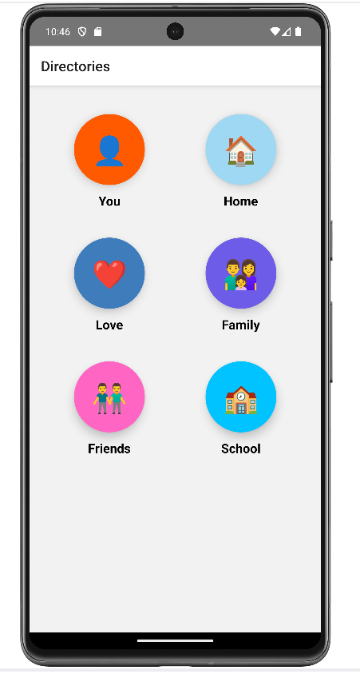
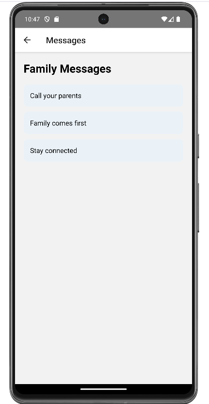
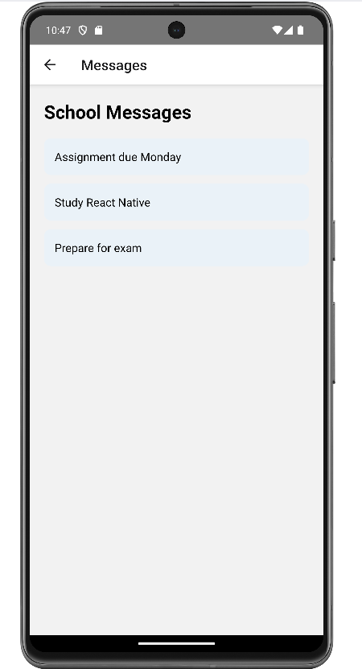

# Message Directory App

## Overview

Message Directory App is a React Native mobile application that displays a list of message directories. Users can select a directory and view the messages stored within that category.

This project was developed as part of a React Native mobile application assignment.

---

## Features

* Display six message directories:

  * You
  * Home
  * Love
  * Family
  * Friends
  * School

* Responsive two-column layout

* Color-coded directory icons

* Navigation between screens

* View messages stored in each directory

* Android emulator support

---

## Technologies Used

* React Native
* JavaScript
* React Navigation
* Android Studio
* Metro Bundler

---

## Project Structure

```text
MessageDirectoryApp
│
├── src
│   ├── data
│   │   └── messages.js
│   │
│   ├── screens
│   │   ├── HomeScreen.js
│   │   └── MessageScreen.js
│   │
│   └── components
│
├── App.tsx
├── package.json
└── README.md
```

---

## Installation

### Prerequisites

* Node.js
* npm
* Android Studio
* Android SDK
* Android Emulator

---

### Clone Repository

```bash
git clone https://github.com/YOUR_USERNAME/MessageDirectoryApp.git
cd MessageDirectoryApp
```

---

### Install Dependencies

```bash
npm install
```

---

### Start Metro Bundler

```bash
npx react-native start
```

---

### Run Application

Open an Android Emulator from Android Studio and execute:

```bash
npx react-native run-android
```

---

## Application Screens

### Home Screen

Displays all available message directories.

### Message Screen

Displays messages associated with the selected directory.

---

## Sample Directories

| Directory | Example Messages                      |
| --------- | ------------------------------------- |
| You       | Believe in yourself, Stay focused     |
| Home      | Welcome home, Dinner at 7 PM          |
| Love      | Spread kindness, Love yourself        |
| Family    | Call your parents, Family comes first |
| Friends   | Meet this weekend, Stay in touch      |
| School    | Study React Native, Prepare for exam  |

---

## How to Use

1. Launch the application.
2. Select a directory from the home screen.
3. View messages stored within the selected category.
4. Use the back button to return to the directory list.

---

## Author

Pranay Arora

Master of Science in Computer Science

Lakehead University

---

## License

This project was created for academic purposes.


## Screenshots

### Home Screen


### Family Messages


### School Messages

